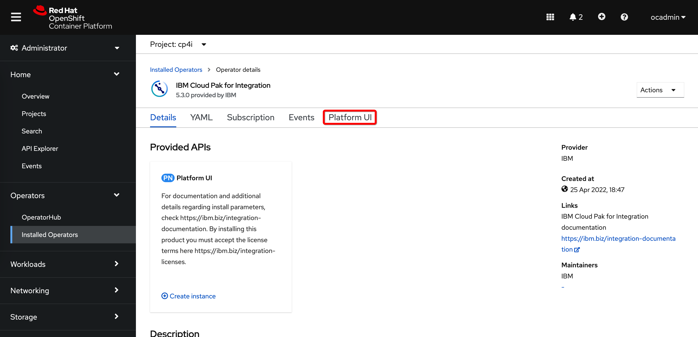

# IBM MQ setup on Cloud Pak for Integration

>***Note:*** This document contains notes collected during the demo installation of IBM MQ as part of the IBM Cloud Pak for Integration (hereafter **CP4I**). Please refer to the official documentation for more details: https://www.ibm.com/docs/en/ibm-mq/9.2?topic=miccpi-using-mq-in-cloud-pak-integration-red-hat-openshift


**Table of contents:**

- [Prerequisites](#prerequisites)
  - [OpenShift Catalog Sources](#catalog-sources)
  - [Entitlement key](#entitlement-key)
- [Install Platform Navigator](#pn-install)
  - [Platform Navigator operator](#pn-operator)
  - [Create OpenShift project](#pn-project)
  - [Create Platform Navigator instance](#pn-instance)
- [Install IBM MQ](#mq-install)
  - [IBM MQ operator](#mq-operator)
  - [OpenShift project](#mq-project)
  - [Create MQ insatnce using Platform Navigator](#mq-instance-pn)
  - [(Alternative) Create MQ instance using OpenShift web console](#mq-instance-op)
  - [(Alternative) Create MQ instance using OpenShift CLI](#mq-instance-cli)

<a name="prerequisites"></a>
## Prerequisites

<a name="catalog-sources"></a>
### OpenShift Catalog Sources

We assume here that IBM Catalogs are already imported. 

If this is a standard, online installation then, if not already, import the catalog using the instructions from the documentation: [Adding catalog sources to an online OpenShift cluster](https://www.ibm.com/docs/en/cloud-paks/cp-integration/2021.4?topic=installing-adding-catalog-sources-online-openshift-cluster).  
In this case, there is only one catalog that contains all IBM Cloud Paks and their components. 

In the case of the air-gapped installation, there is a separate catalog for each component of the CP4I. 
Please see the following chapter in the documentation: [Adding catalog sources to an air-gapped OpenShift cluster](https://www.ibm.com/docs/en/cloud-paks/cp-integration/2021.4?topic=installing-adding-catalog-sources-air-gapped-openshift-cluster)
and my [notes](https://github.com/sreckoj/IBM-CP4I-air-gapped-installation) related to the air-gapped installation.


These notes are written as a continuation of [Air-gapped installation of IBM Cloud Pak for Integration](https://github.com/sreckoj/IBM-CP4I-air-gapped-installation)  where, as a result of the air-gapped installation we have a *Platform UI*, *IBM App Connect* and *IBM MQ* available in the catalogs and we have a local registry with already mirrored images. 


<a name="entitlement-key"></a>
### Entitlement key

In case if the standard, online, installation the IBM Entitlement key is needed and must be stored in the secret named **ibm-entitlement-key** in each OpenShift project that contains instances of the integration capabilities that are part of the CP4I. This key is used for authentication when pulling images from the IBM registry. If you are entitled to the CP4I, you can obtain your key here: https://myibm.ibm.com/products-services/containerlibrary

The scenario described in these notes is a continuation of the scenario described in the [Air-gapped installation of IBM Cloud Pak for Integration](https://github.com/sreckoj/IBM-CP4I-air-gapped-installation) 
Since we mirrored images to the local registry the entitlement key is not required in our case (it was required and provided during the process of mirroring).

<a name="pn-install"></a>
## Install Platform Navigator

The Platform Navigator is a CP4I user interface that makes the process of creating instances of the integration products easier. It is not mandatory to use it, but it allows creating instances without having deep knowledge about the OpenShift and the concept of operators and operands. 

<a name="pn-operator"></a>
### Platform Navigator operator


Navigate to **Operators -> OperatorHub** and search for **cp4i**. Select the **IBM Cloud Pak for Integration** (this is the name of the Platform Navigator operator)


Click on **Install**

 

Select the **latest channel**. In our case, we will install it to be visible in **all namespaces** and we will select an **automatic** update approval. The alternative is to install it in a specific namespace and define a manual update approval policy. Click on **Install** at the end.


The operator installation starts. You can watch the process under **Operators -> Installed Operators**


If this is the first installation of any of the IBM Cloud Pak operators, the namespace **ibm-common-services** will also be created with common services operators used by all Cloud Pak other operators.  


<a name="pn-project"></a>
### Create OpenShift project

This document is a continuation of the steps described in [Air-gapped installation of IBM Cloud Pak for Integration](https://github.com/sreckoj/IBM-CP4I-air-gapped-installation).

We will reuse already created project named **cp4i**.
Otherwise you can create one:
```
oc new-project cp4i
```

As already stated above, the scenario described here uses mirrored registry so we don't need the *ibm-entitlement-key* in our project. Otherwise, you should create it with the following command:
```
oc create secret docker-registry ibm-entitlement-key --docker-username=cp --docker-password=$ENTITLEMENT_KEY --docker-server=cp.icr.io --namespace=cp4i
```  
where *$ENTITLEMENT_KEY* is a variable that contains your key. 


<a name="pn-instance"></a>
### Create Platform Navigator instance

Navigate to **Operators -> Installed Operators**, select the **project** (in our case *cp4i*) and select **IBM Cloud Pak for Integration** operator:


Select **Platform UI**:



Click on **Create PlatformNavigator**:

>***Note:*** If button *Create PlatformNavigator* is not visible and if the page content shows an error, just refresh the page in the browser. 


Enter the instance **name** and **accept license**_


Scorll down, leave default true value for **MQ dashboard**, select avaliable RWX **storage** type, click on **Create** to confirm:


The instance creation starts. It takes up to 45 minutes until it is completed. Please be patient.


When the instance is ready, click on it:


Note the URL of the Platform Navigator on the overview page:


To obtain the password of the Platform Navigator **admin** user select **Workloads -> Secrets** in the project **ibm-common-services** and find the secret **platform-auth-idp-credentials**


The secret contains the admin password:


You can now open and login to the Platform Navigator:


<a name="mq-install"></a>
## Install IBM MQ

<a name="mq-operator"></a>
### IBM MQ operator

Navigate to **Operators -> OperatorHub** and search for **cp4i**. Select the **IBM MQ** 


Click on **Install**


Select the latest **channel**, and decide whether you want the operator to be visible in all namespaces or in a specific namespace (in our case, we selected *All namespaces*). Also, decide if you want operator updates to be automatically approved or you want to manually approve them:


Wait until the operator is installed:


<a name="mq-project"></a>
### OpenShift project

You can use the same project that is previously created for the Platform Navigator or you can create a separate one. It is important to know that if the operators are created in all namespaces then it is enough to have only one instance of the Platform Navigator. It will be able to "see" the MQ instance even if it is in another project. If the operators are installed in a specific project (namespace) then the Platform Navigator instance will "see" only the MQ instances that are in the same project and will not see instances that potentially exist in other projects.

You can create the project from the web console or command line, for example:
```
oc new-project mq
```  

Again, the scenario described here uses mirrored registry so we don't need the *ibm-entitlement-key* in our project. Otherwise, you should create it with the following command:
```
oc create secret docker-registry ibm-entitlement-key --docker-username=cp --docker-password=$ENTITLEMENT_KEY --docker-server=cp.icr.io --namespace=mq
```  
where *$ENTITLEMENT_KEY* is a variable that contains your key. 

<a name="mq-instance-pn"></a>
### Create MQ insatnce using Platform Navigator

Open the Platform Navigator, and go to the main menu:


Select **Integration instances**


Click on the button **Create instance**:


The instance types for which you haven't yet installed the operators are "greyed". 


In our case, we have only an IBM MQ operator, scroll a bit down and you will see the **Messaging** capability available. Click on it and then click **Next**:


Select one of the provided installation options. In our case, we will try with the **Quickstart** - non-production option. Click **Next**


Give some **name** to the instance, select the namespace, in our case, we selected previously created project **mq**, accept **license**

  

Scroll down. Under section **Queue manager**, you can select the **availability type** which can be *MultiInstance*, *SingleInstance* or *NativeHA* In this demo we will leave default *SingleInstance*. We will prepare an extra test for the *NativeHA*.

Under **Storage**, you can whether to have an ephemeral or persistent configuration. If you select **persistent** then you have to select also a storage class. In our setup, we had available NFS storage.


Scroll down. In order to use **Tracing** a separate Cloud Pak component called **Operations Dashboard** has to be installed. Since we haven't installed it yet we will skip this option at this point (we will try it in a separate demo).

Leave version and web console selection as is. 
You can click **Create** to start the instance creation. Before doing that you can switch to the **YAML** view to see the YAML definition of the QueueManafer OpenShift Custom Resource:


Wait until the MQ instance is provisioned


It should be ready after a few minutes:


You may also check the status of the pod(s) in the selected project:


Check services. You will see there is a service that is listening on the standard port 1414. 


There is also a route created. It can be used by the external clients:


<a name="mq-instance-op"></a>
### (Alternative) Create MQ instance using OpenShift web console

Navigate to **Operators -> Installed Operators**. Select the project in which you want to have the instance.


Click on the **Create instance** link on the first page or click on the tab **Queue Manager** and then on the button **Create QueueManager**


A form that contains the same data as in the case of the installation using Platform Navigator will open.
Enter the **name** and accept **license**


Scroll down to see **Availability**, **Storage**, **Tracing**, and **Web** options similar to the previously described installation using the Platform Navigator (see above). Confirm by clicking on **Create**


A new instance will appear on the list


<a name="mq-instance-cli"></a>
### Alternative) Create MQ instance using OpenShift CLI

Please see [Create MQ instance using Platform Navigator](#mq-instance-pn) above for the details related to the project and the queue manager properties.

Open the terminal and log in to the OpenShift.

Prepare YAML file, name it, for example, **MyQueueManager.yaml**
```yaml
apiVersion: mq.ibm.com/v1beta1
kind: QueueManager
metadata:
  name: mq3
  namespace: mq
spec:
  license:
    accept: true
    license: L-RJON-C7QG3S
    use: NonProduction
  queueManager:
    name: QUICKSTART
    resources:
      limits:
        cpu: 500m
      requests:
        cpu: 500m
    storage:
      queueManager:
        type: persistent-claim
      defaultClass: managed-nfs-storage
  template:
    pod:
      containers:
        - env:
            - name: MQSNOAUT
              value: 'yes'
          name: qmgr
  version: 9.2.5.0-r1
  web:
    enabled: true
```

Create or navigate to the existing project and apply the YAML definition:
```
oc project mq

oc apply -f MyQueueManager.yaml
```

Verify
```
oc get QueueManager -n mq
```

The response should be similar to the following (in our case, also the previously created QueueManagers are visible):
```
NAME   PHASE
mq1    Running
mq2    Running
mq3    Pending
```
